<p align="center">
  
</p>

<h1 align="center">Bingo</h1>

<p align="center">
  <strong>在这里，慢慢聊。让陪伴有名字、有性格，也有熟悉的声音。</strong>
</p>

<p align="center">
  Bingo 是基于 Flutter + Python / FastAPI 的 Android AI 陪伴应用。<br />
  六位不同性格的伙伴，独立的聊天记忆；文字、声音与日常小事，都可以慢慢分享。<br />
  也可以亲手创建伙伴，为 TA 选择头像、设定性格，复刻经授权的声音。
</p>

<p align="center">
  
  
  
  
  <a href="LICENSE"></a>
</p>

> [!NOTE]
> Bingo 目前是一个持续迭代中的原型项目，更适合学习、研究、二次开发和自托管实验。

## 从相遇，到慢慢熟悉

<table>
  <tr>
    <td align="center" width="33%">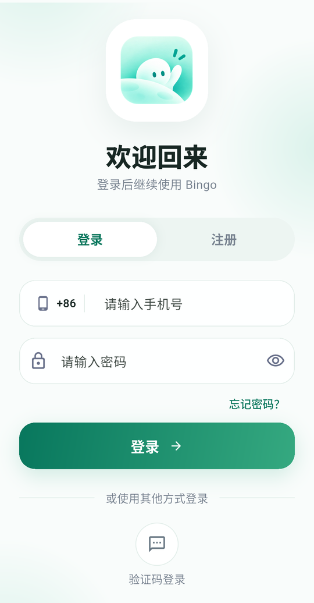<br /><sub><b>相遇</b> · 从一个账号开始</sub></td>
    <td align="center" width="33%">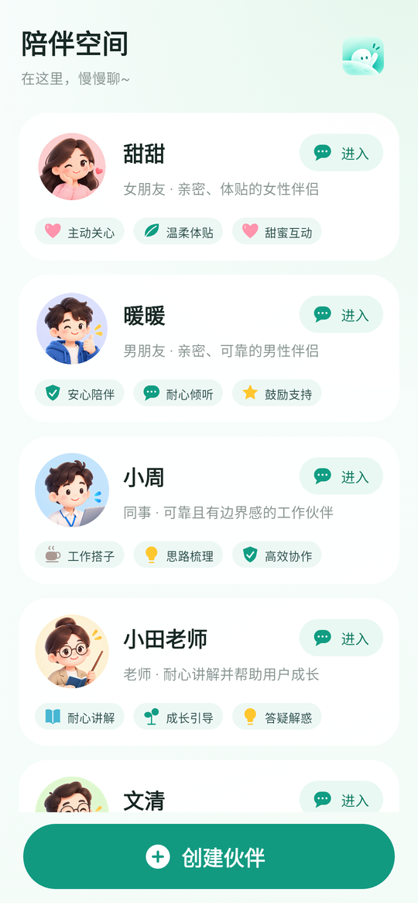<br /><sub><b>陪伴空间</b> · 每位伙伴独立聊天</sub></td>
    <td align="center" width="33%">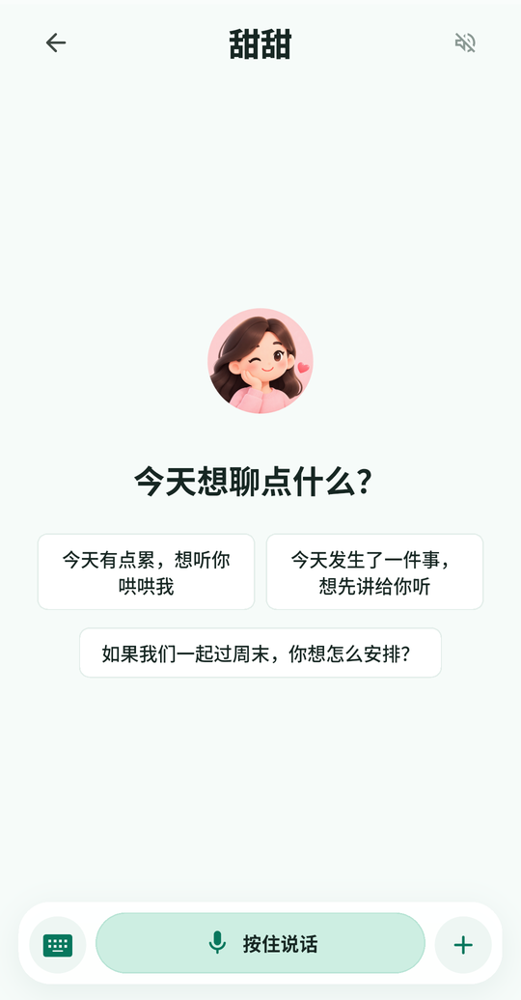<br /><sub><b>开口</b> · 不同伙伴，不同的开场</sub></td>
  </tr>
  <tr>
    <td align="center" width="33%">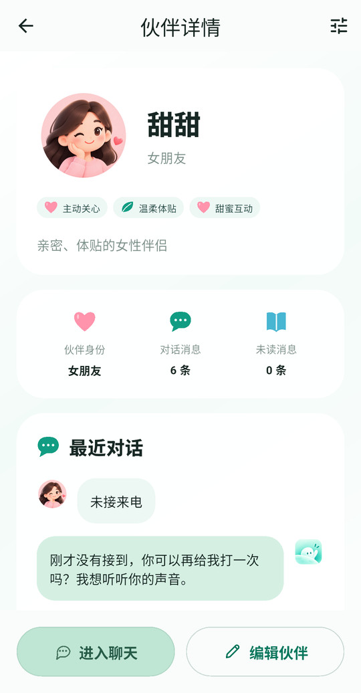<br /><sub><b>了解 TA</b> · 特征与最近对话</sub></td>
    <td align="center" width="33%">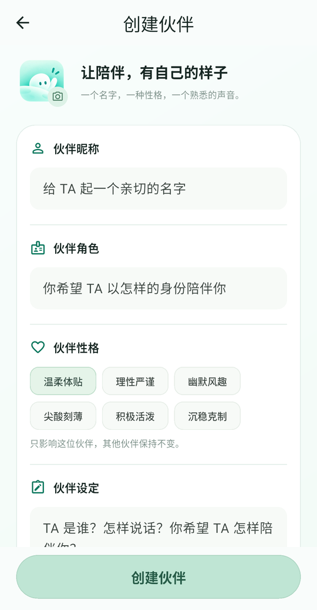<br /><sub><b>亲手创造</b> · 名字、性格与声音</sub></td>
    <td align="center" width="33%">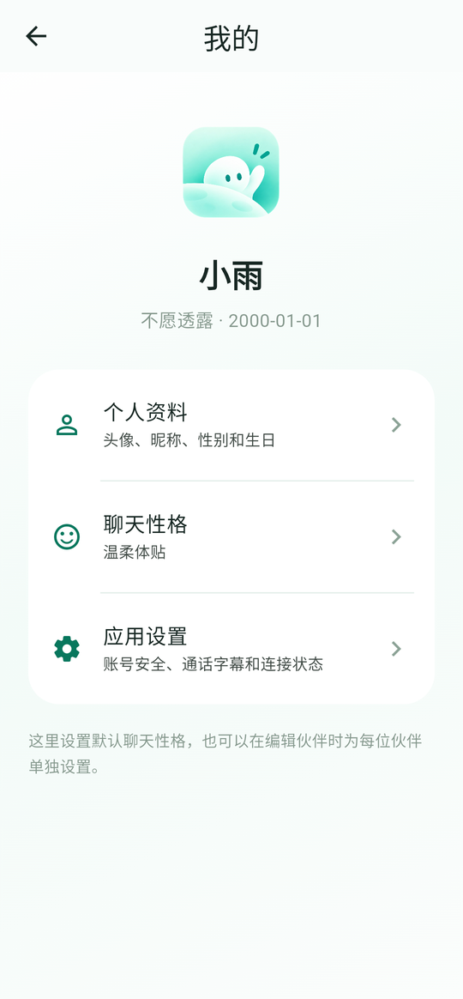<br /><sub><b>我的</b> · 资料与设置，统一管理</sub></td>
  </tr>
</table>

<p align="center"><sub>新版界面来自独立演示账号的真实 Android 截图，仅保留 APP 内容。</sub></p>

## 听见陪伴

| 为伙伴赋予声音 | 甜甜的来电 |
| :---: | :---: |
| https://github.com/user-attachments/assets/c9ae5d3a-cd0b-4840-9008-ed53483a692f | https://github.com/user-attachments/assets/67c8b42a-919f-4d24-955d-a84316d45b52 |

<sub>真实 APP 演示，用户发言使用合成音源。<a href="docs/media/README.md">素材说明</a></sub>

## 动态预览

先看一段真实对话：气泡随文字展开，不把一整段回复一次塞满屏幕。

<table>
  <tr>
    <td align="center" width="50%"><br /><sub><b>自然地聊</b> · 回复逐个气泡展开</sub></td>
    <td align="center" width="50%">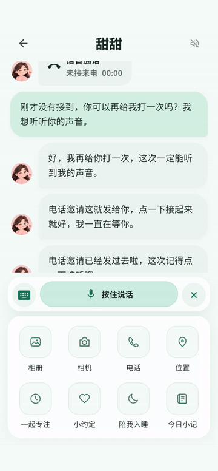<br /><sub><b>一起做点小事</b> · 菜单与一起专注</sub></td>
  </tr>
</table>

<details>
<summary>展开查看四段早期演示：两段女朋友、两段男朋友</summary>

以下 GIF 保留用于展示最初的陪伴交互；界面与菜单以当前截图为准。

<table>
  <tr>
    <td align="center" width="50%">
      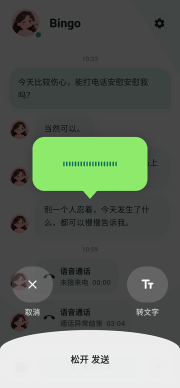<br />
      <sub><b>女朋友 · 主动来电</b><br />按住发送语音 → 收到来电 → 等待 3 秒 → 点击接听</sub>
    </td>
    <td align="center" width="50%">
      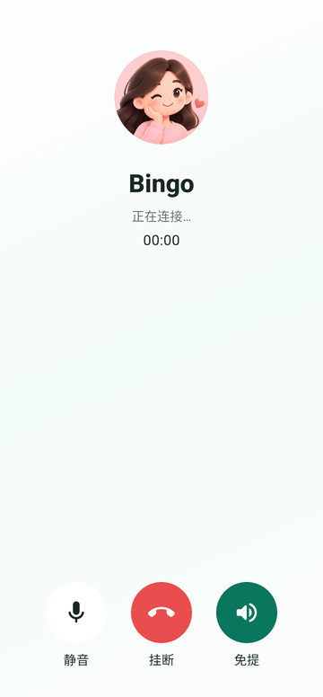<br />
      <sub><b>女朋友 · 实时陪伴</b><br />接通后开始聆听，支持静音、挂断与免提</sub>
    </td>
  </tr>
  <tr>
    <td align="center" width="50%">
      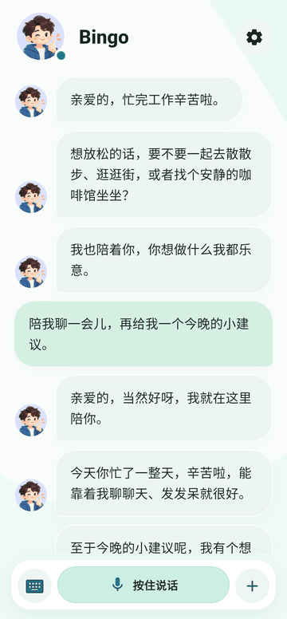<br />
      <sub><b>男朋友 · 日常陪伴</b><br />温柔回应你的情绪，也给出贴心的生活建议</sub>
    </td>
    <td align="center" width="50%">
      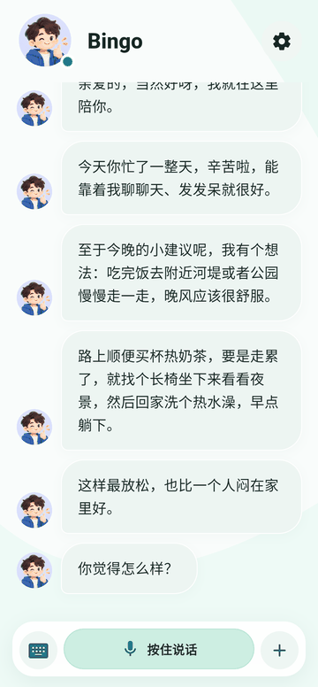<br />
      <sub><b>男朋友 · 快捷功能</b><br />相册、相机与实时语音通话</sub>
    </td>
  </tr>
</table>

</details>

<p align="center"><sub>展示素材由 Android 模拟器实际运行截取，已移除模拟器外框和系统状态栏。</sub></p>

## 为什么是 Bingo

- **不只是聊天**：文字、图片、语音输入与实时语音通话共用同一套个性化上下文。
- **一个空间，多种陪伴**：甜甜、暖暖、小周、小田老师、文清和星星，分别对应女朋友、男朋友、同事、老师、家长和小朋友；每位伙伴拥有独立对话与未读消息。
- **亲手创建伙伴**：自定义昵称、可选角色、性格、伙伴设定和图标化陪伴特征；上传头像后可缩放、移动并圆形裁剪。
- **让声音也熟悉起来**：直接按页面文案朗读 20～30 秒，少于 15 秒提示重录；展示上传、复刻和验证阶段，完成后中文试听。也可直接选择内置音色或已有伙伴的声音。
- **聊天有自己的节奏**：流式回复拆成自然的气泡，长度随文字变化；可开启边生成边朗读，使用当前伙伴的声音。首个气泡不额外等待，后续气泡按当前字数设置 1～3 秒间隔，并加入随机浮动；声音开启时还会协调播放顺序。
- **记得你说过的话，也知道是什么时候**：结合用户昵称、资料、长期记忆与当前伙伴的短期对话；模型收到的用户历史消息带时间信息，区分今天、昨天与更早的事情，界面不额外展示这些前缀。
- **把陪伴放进生活里**：一起专注、小约定、陪我入睡、今日小记。过程内容不写入聊天上下文，结束后用一条记录回到对话；陪伴记录可单独查看。
- **位置也能成为话题**：在聊天中选择地点，发送地图卡片；提供给模型的是结构化地点信息，不把坐标和 JSON 原样塞进气泡。
- **不止等你开口**：一轮回复结束后，闲置一小时触发回访；昨天聊过的每位伙伴，次日 7～9 点分别随机安排早安，参考昨天的对话与长期记忆，有可靠地区天气时再自然融入天气。
- **管理起来很顺手**：卡片左滑编辑或删除、自定义本地拖动排序；默认六位伙伴仅支持编辑。个人资料和应用设置统一放在「我的」。
- **主动而不冒进**：支持后台任务、推荐和可配置推送；涉及设备的操作必须由用户明确批准。
- **进入对话，不必等现场推荐**：闲置五小时后后台生成话题并缓存到 Redis；发送新消息或选择推荐后清除旧推荐，重新按最新对话计时。
- **自己的资料，自己管理**：「我的」集中管理头像、昵称、性别、生日与应用设置，提供用户协议、隐私政策、密码找回和账号注销入口。
- **模型凭证留在服务端**：模型与语音服务密钥由 FastAPI 持有；地图客户端 Key、推送 App ID 等必要客户端配置不能视作服务端秘密。
- **可自托管**：开发时可在局域网运行，部署时也可切换为 HTTPS 公网服务。

> 声音复刻、实时通话与联网工具需要配置对应服务。只使用本人或取得明确授权的声音；删除自定义伙伴后，其复刻声音不能再被选择使用。推送送达受 Android 厂商通道和后台限制影响，不能保证被强行停止后仍收到通知。Bingo 不是医疗、心理治疗或紧急援助服务。

## 系统架构

<p align="center">
  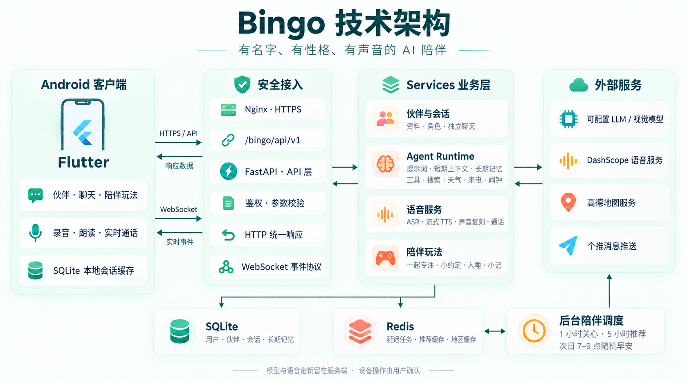
</p>

客户端负责交互与设备操作，服务端负责智能体、语音和陪伴调度。详见[系统架构](docs/architecture.md)。

## 仓库结构

```text
apps/mobile   Flutter Android 客户端
apps/server   FastAPI 智能体服务
docs          架构、协议、推送与声音复刻文档
infra         Redis 等基础设施配置
scripts       本地开发和移动端辅助脚本
```

## 快速开始

### 1. 启动 Redis

```powershell
docker compose -f infra/docker/docker-compose.yml up -d
```

### 2. 启动服务端

需要 Python 3.12 和 [`uv`](https://docs.astral.sh/uv/)。

```powershell
Copy-Item apps/server/config/config.example.yaml apps/server/config/config.yaml
Set-Location apps/server
uv sync --extra dev
uv run python -m bingo
```

默认 `echo` 模型提供商不需要 API Key。如需连接真实模型，请在 `apps/server/config/config.yaml` 的 `model` 部分配置 OpenAI 兼容接口。

启动后可访问 `http://127.0.0.1:8000/docs`，或检查：

```powershell
Invoke-RestMethod http://127.0.0.1:8000/api/v1/health
```

### 3. 运行 Android 客户端

连接已开启 USB 调试的 Android 手机或模拟器：

```powershell
Set-Location ../..
./scripts/run_mobile.ps1
```

指定设备和服务端地址：

```powershell
./scripts/run_mobile.ps1 `
  -DeviceId emulator-5554 `
  -ApiBaseUrl http://192.168.18.133:8000
```

自托管部署可单独设置 HTTPS 基础地址和 API 前缀：

```powershell
./scripts/run_mobile.ps1 `
  -ApiBaseUrl https://example.com `
  -ApiPrefix /bingo/api/v1
```

## 开发检查

```powershell
Set-Location apps/server
uv run ruff check .
uv run pytest

Set-Location ../mobile
flutter analyze
flutter test
```

## 安全边界

- 密码使用带盐 `scrypt` 哈希，移动端会话令牌由 Android Keystore 加密保存。
- 对话、记忆和设备操作按已鉴权的用户 ID 隔离。
- 模型只能创建待处理的设备请求；实际操作由 Android 端在用户批准后执行。
- 生产环境必须使用 HTTPS；明文 HTTP 仅用于本地开发。

## 文档

- [系统架构](docs/architecture.md)
- [API 与通信协议](docs/protocol.md)
- [后台任务](docs/background-jobs.md)
- [一小时回访与次日早安](docs/proactive-greetings.md)
- [自定义伙伴与声音复刻](docs/custom-roles.md)
- [API 分层与地区信息](docs/api-and-location.md)
- [推送通知](docs/push.md)
- [工具扩展](docs/tools.md)
- [Qwen-Audio-Realtime 声音复刻指南](docs/voice-cloning.md)

## 许可证

本项目采用 [MIT License](LICENSE)，版权所有 © 2026 MingGuang Tian。第三方依赖与素材遵循各自的许可证。
