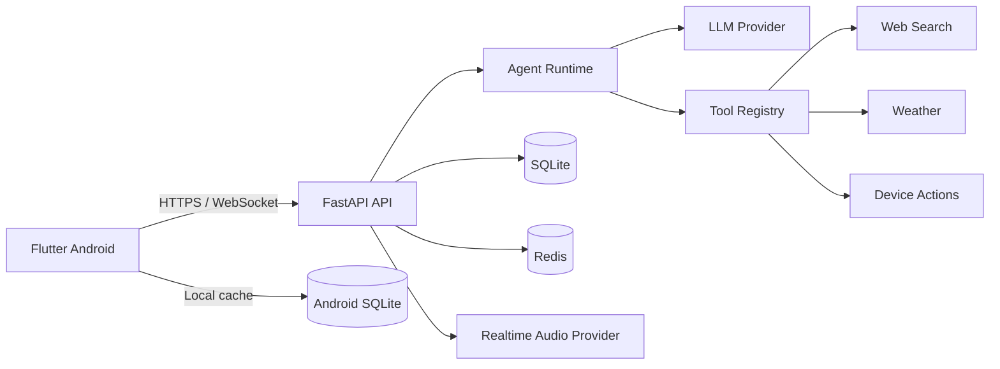

<p align="center">
  
</p>

<h1 align="center">Bingo</h1>

<p align="center">
  <strong>一个懂你、能陪伴、也能帮你做事的 Android AI 个人助手。</strong>
</p>

<p align="center">
  支持个性化角色、文字与图片对话、实时语音通话、长期记忆、主动陪伴和经用户确认的设备操作。
</p>

<p align="center">
  
  
  
  
</p>

> [!NOTE]
> Bingo 目前是一个持续迭代中的原型项目，更适合学习、研究、二次开发和自托管实验。

## 界面预览

<table>
  <tr>
    <td align="center" width="50%">
      <br />
      <sub><b>女朋友 · 主动来电</b><br />按住发送语音 → 收到来电 → 等待 3 秒 → 点击接听</sub>
    </td>
    <td align="center" width="50%">
      <br />
      <sub><b>女朋友 · 实时陪伴</b><br />接通后开始聆听，支持静音、挂断与免提</sub>
    </td>
  </tr>
  <tr>
    <td align="center" width="50%">
      <br />
      <sub><b>男朋友 · 日常陪伴</b><br />温柔回应你的情绪，也给出贴心的生活建议</sub>
    </td>
    <td align="center" width="50%">
      <br />
      <sub><b>男朋友 · 快捷功能</b><br />相册、相机与实时语音通话</sub>
    </td>
  </tr>
</table>

<p align="center"><sub>展示素材由 Android 模拟器实际运行截取，已移除模拟器外框和系统状态栏。</sub></p>

## 为什么是 Bingo

- **不只是聊天**：文字、图片、语音输入与实时语音通话共用同一套个性化上下文。
- **真正个性化**：可设置助手名称、陪伴角色、性格与头像，服务端按请求组装专属提示词。
- **记得你说过的话**：对话和长期记忆按用户隔离，Android 端同时保存本地会话副本。
- **主动而不冒进**：支持延迟陪伴、推荐与推送；涉及设备的操作必须由用户明确批准。
- **密钥不进 APK**：模型、实时语音和第三方服务凭证全部保留在 FastAPI 服务端。
- **可自托管**：开发时可在局域网运行，部署时也可切换为 HTTPS 公网服务。

## 系统架构



- Flutter 负责交互、本地会话恢复、音频采集播放与 Android 设备操作。
- FastAPI 负责鉴权、模型访问、对话状态、记忆、工具编排与实时音频协议转换。
- Redis 负责持久化延迟陪伴任务和推荐队列。

## 仓库结构

```text
apps/mobile   Flutter Android 客户端
apps/server   FastAPI 智能体服务
docs          架构、协议、推送与声音复刻文档
infra         Redis 等基础设施配置
scripts       本地开发和移动端辅助脚本
```

## 快速开始

### 1. 启动 Redis

```powershell
docker compose -f infra/docker/docker-compose.yml up -d
```

### 2. 启动服务端

需要 Python 3.12 和 [`uv`](https://docs.astral.sh/uv/)。

```powershell
Copy-Item apps/server/config/config.example.yaml apps/server/config/config.yaml
Set-Location apps/server
uv sync --extra dev
uv run python -m bingo
```

默认 `echo` 模型提供商不需要 API Key。如需连接真实模型，请在 `apps/server/config/config.yaml` 的 `model` 部分配置 OpenAI 兼容接口。

启动后可访问 `http://127.0.0.1:8000/docs`，或检查：

```powershell
Invoke-RestMethod http://127.0.0.1:8000/api/v1/health
```

### 3. 运行 Android 客户端

连接已开启 USB 调试的 Android 手机或模拟器：

```powershell
Set-Location ../..
./scripts/run_mobile.ps1
```

指定设备和服务端地址：

```powershell
./scripts/run_mobile.ps1 `
  -DeviceId emulator-5554 `
  -ApiBaseUrl http://192.168.18.133:8000
```

自托管部署可单独设置 HTTPS 基础地址和 API 前缀：

```powershell
./scripts/run_mobile.ps1 `
  -ApiBaseUrl https://example.com `
  -ApiPrefix /bingo/api/v1
```

## 开发检查

```powershell
Set-Location apps/server
uv run ruff check .
uv run pytest

Set-Location ../mobile
flutter analyze
flutter test
```

## 安全边界

- 密码使用带盐 `scrypt` 哈希，移动端会话令牌由 Android Keystore 加密保存。
- 对话、记忆和设备操作按已鉴权的用户 ID 隔离。
- 模型只能创建待处理的设备请求；实际操作由 Android 端在用户批准后执行。
- 生产环境必须使用 HTTPS；明文 HTTP 仅用于本地开发。

## 文档

- [系统架构](docs/architecture.md)
- [API 与通信协议](docs/protocol.md)
- [后台任务](docs/background-jobs.md)
- [推送通知](docs/push.md)
- [工具扩展](docs/tools.md)
- [Qwen-Audio-Realtime 声音复刻指南](docs/voice-cloning.md)
